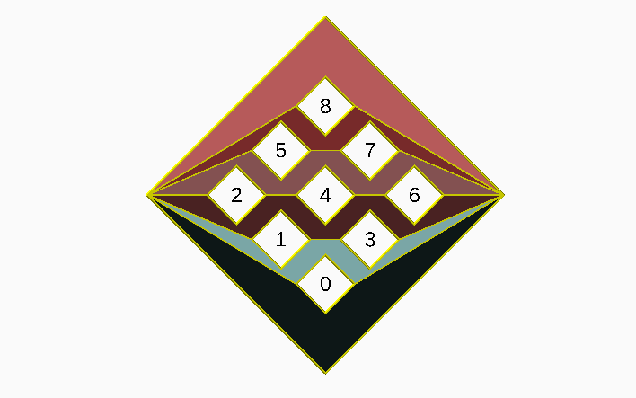
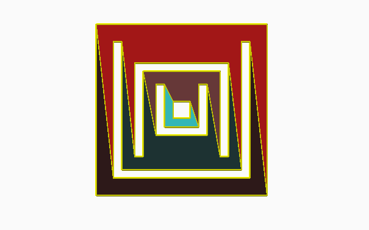
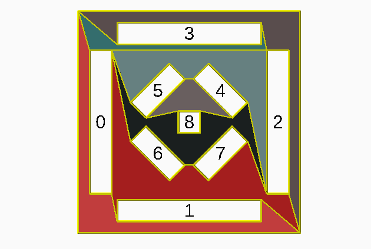

# Polygon-stuffs
A small bunch of functions to deal with polygons

## [polyHolePartition.scad](polyHolePartition.scad)

This function generates a partition of a polygon with holes such that
each part of the partition is a simple polygon.
The generated patition has at most m+1 parts.
It may not be optimal in the number of the parts for the given data.

## [polygonTriangulation.scad](polygonTriangulation.scad)

This library contains three set of functions: the first set triangulates a
simple 2D polygon; the second, tests if a 2D polygon is simple and
the last one adjusts a best fit plane to a closed 3D polygonal and projects that 
polygonal in the adjusted plane generating a 2D polygon (eventually not simple).

## [polyHolePartition_Tests.scad](polyHolePartition_Tests.scad)

A set of test cases for polyHolePartition.scad

## [sweep_polyHole.scad](sweep_polyHole.scad)

An application example of polyHolePartition: the sweep of a 2d shape which is a polygon with holes.

