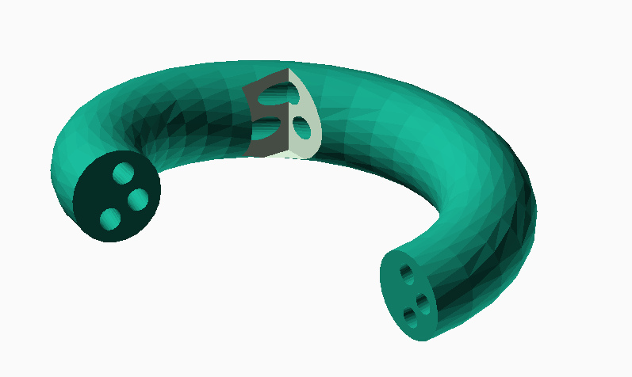

# Polygon-stuffs
A small bunch of functions to deal with polygons

## [polyHoles.scad](polyHoles.scad)
This function converts a polygon expressed by one outer border
and a list of internal hole borders in one polygon expressed
by just one border by introducing two-way bridges connecting
those borders. The output list will be a proper concatenation
of subsequences of the incoming borders and will contain all the
incoming vertices. 

## [polyHolePartition.scad](polyHolePartition.scad)

This function generates a partition of a polygon with holes such that
each part of the partition is a simple polygon.
The generated patition has at most m+1 parts.
It may not be optimal in the number of the parts for the given data.

## [polygonTriangulation.scad](polygonTriangulation.scad)

Function triangulate() finds a triangulation by the ear-cut algorithm of a 
polygon in a class a little bigger than the simple polygons.
It generates, if possible, a list of triangles in the form of three 
indices of the incoming vertices.  
The vertices of the input polygon should pass the polyCheck() test
to be accepted by triangulate(). Simple polygons and keyhole representation
of polygons with holes always pass that check. If the input polygon doesn't 
pass polyCheck, a wrong and incomplete triangulation may be output.
The output list of triangles has length equal to the number of  
incoming vertices minus 2. If the input polygon doesn't pass polyCheck 
the function may return a shorter list and/or a wrong triangulation. 

## [polyHolePartition_Tests.scad](polyHolePartition_Tests.scad)

A set of test cases for polyHolePartition.scad

## [sweep_polyHole.scad](sweep_polyHole.scad)

An application example of polyHolePartition: the sweep of a 2d shape which is a polygon with holes.

